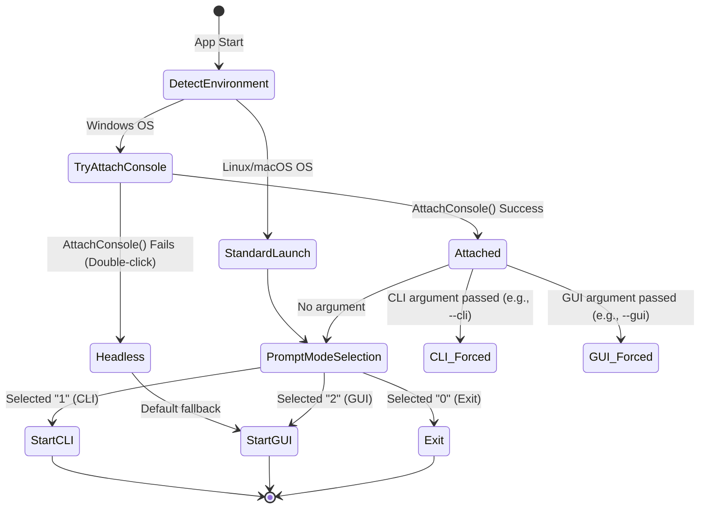

# Data Model and State Transitions: Windows GUI Validation

Purely infrastructural feature; no persistent business entities are added. However, we track the application's runtime execution state and environment detection.

## Application Execution State

### Execution Mode State Machine

The launcher determines the execution path based on the presence of a parent console and command-line arguments.

### State Fields

We represent the runtime context using the following parameters:

| Variable | Type | Description |
| :--- | :--- | :--- |
| `has_parent_console` | `bool` | True if successfully attached to parent terminal via `AttachConsole`. |
| `selected_mode` | `str` | `"CLI"`, `"GUI"`, or `"EXIT"`. |
| `hw_info` | `dict` | Hardware information dictionary collected via `modules.hardware`. |
