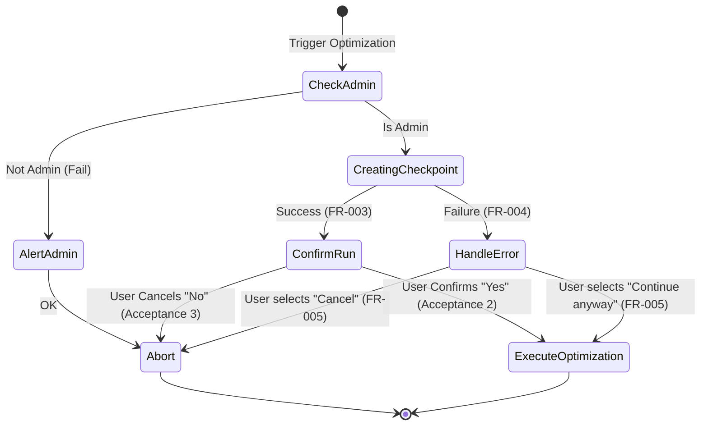

# Data Model: Ponto de Restauração Automático

This document defines the data structures, states, and transitions for the Automatic Restore Point feature.

## Core States

### 1. Verification State (`RestorePointState`)
Represents the system status during the initialization:
*   `ADMIN_CHECK`: Verifying if running as Administrator.
*   `CREATING`: Creating the restore point (PowerShell running).
*   `SUCCESS`: Restore point created successfully.
*   `FAILED`: Restore point creation failed.
*   `CANCELLED`: User cancelled the operation.

### 2. Result representation (`RestorePointResult`)
The outcome returned by the core module to the calling interface (CLI/GUI):
*   `status`: `"success"` | `"failed"` | `"skipped"`
*   `error_msg`: `str` or `None` (detailing failure reason, e.g. "Access Denied", "Limit Reached", "Disabled")

---

## State Transition Flow

---

## Validation and Error Rules

1.  **Administrative Privileges Validation**:
    *   Command must check `ctypes.windll.shell32.IsUserAnAdmin()` before calling PowerShell.
2.  **PowerShell Command Timeout Validation**:
    *   `subprocess.run` must have a timeout of at least 120 seconds, as `Checkpoint-Computer` is slow.
3.  **Frequency Limit Validation**:
    *   If PowerShell stdout/stderr contains code `0x80042316` or text about "frequency", it must map to the specific error: `Restore point limit reached for today`.
